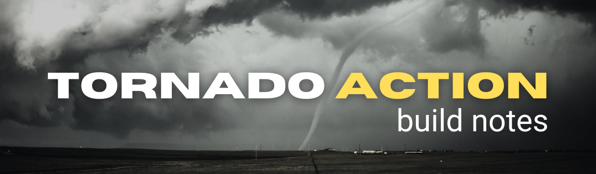

<!-- #region INTRO -->

[Resources](#resources) | [Notes](#notes) | [Issues](#issues) | [Issues](#issues) | [Questions](#questions) | [Connect](#connect)

:white_check_mark: display current tornado warning & watch counts on landing screen

:white_check_mark: user can can click to see all tornado warnings

:white_check_mark: user can can click to see all tornado watches

:white_check_mark: display radar

:white_check_mark: display historical tornado stats from [VORTX API](https://github.com/ephraimsmithdev/vortx)

:white_large_square: display tornado info & safety resource links in footer

<!-- #endregion /INTRO -->
<!-- #region RESOURCES -->

<h3 id='resources' align='center'>

</h3>

[Resources](#resources) | [Notes](#notes) | [Issues](#issues) | [Issues](#issues) | [Questions](#questions) | [Connect](#connect)

<!-- #region ISSUES -->

<h3 id='issues' align='center'>

</h3>

[Resources](#resources) | [Notes](#notes) | [Issues](#issues) | [Issues](#issues) | [Questions](#questions) | [Connect](#connect)

<!-- #endregion /ISSUES -->

<!-- #region NOTES -->

<h3 id='notes' align='center'>

</h3>

[Resources](#resources) | [Notes](#notes) | [Issues](#issues) | [Issues](#issues) | [Questions](#questions) | [Connect](#connect)

<!-- #endregion /NOTES -->

<!-- #region QUESTIONS -->

<h3 id='questions' align='center'>

</h3>

[Resources](#resources) | [Notes](#notes) | [Issues](#issues) | [Issues](#issues) | [Questions](#questions) | [Connect](#connect)

<!-- #endregion /QUESTIONS -->

<!-- #region CONNECT -->

<h3 id='connect' align='center'>

</h3>

[Resources](#resources) | [Notes](#notes) | [Issues](#issues) | [Issues](#issues) | [Questions](#questions) | [Connect](#connect)

<table align='center'>
  <tr >
    <td style="border: none;"></td> 
    <td style="border: none;"></td>                      
    <td style="border: none;"></td>  
    <td style="border: none;"></td>
    <td style="border: none;"></td>
  </tr>
</table>

<!-- #endregion /CONNECT -->
