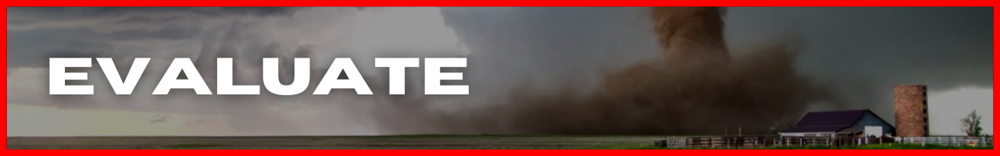

<!-- #region GRAPHIC & NAV -->

<div align='center'>


</div>

<div align='right'>

[discover](#discover) | [define](#define) | [market](#market) | [deliver](#deliver) | [evaluate](#evaluate)

</div>

<div align='right'>

  <a href='https://github.com/ephbuilding' alt='social link icon'>
    
  </a>
  &nbsp;
  &nbsp;
  <a href='mailto:email@ephraimsmith.dev' alt='social link icon'>
    
  </a>
  &nbsp;
  &nbsp;
  <a href='https://twitter.com/ephbuilding' alt='social link icon'>
    
  </a>
  &nbsp;
  &nbsp;
  <a href='https://instagram.com/ephbuilding' alt='social link icon'>
    
  </a>
  &nbsp;
  &nbsp;
  <a href='https://linkedin.com/in/ephbuilding' alt='social link icon'>
    
  </a>

</div>

<!-- #endregion /GRAPHIC & NAV -->

# INTRO

I'm constantly working on my build process. ( not just for software projects ) Right now, it looks something like this:

1. **_discover_**: figure out what/why to build
1. **_define_**: define 'done'. define deadlines...for EVERY piece of the project
1. **_market_**: people can't use it if they don't know about it. comes before 'deliver' on purpose
1. **_deliver_**: build v1 AFAFP ( give it a second ) to get the feedback loop started **_FAST_**!
1. **_evaluate_**: keep going or kill it ( quietly of course ;)

`BUILD_NOTES.md` reflects this process. Each section contains notes, cool finds, landmines, questions, & resources specific to that phase.

I'm basically giving you a frontrow seat to how my brain works. Hope you have a sense of humor.

<!-- #region GRAPHIC & NAV -->

<div id='discover' align='center'>


</div>

<div align='right'>

[discover](#discover) | [define](#define) | [market](#market) | [deliver](#deliver) | [evaluate](#evaluate)

</div>

<div align='right'>

  <a href='https://github.com/ephbuilding' alt='social link icon'>
    
  </a>
  &nbsp;
  &nbsp;
  <a href='mailto:ephraim@modevx.com' alt='social link icon'>
    
  </a>
  &nbsp;
  &nbsp;
  <a href='https://twitter.com/ephbuilding' alt='social link icon'>
    
  </a>
  &nbsp;
  &nbsp;
  <a href='https://instagram.com/ephbuilding' alt='social link icon'>
    
  </a>
  &nbsp;
  &nbsp;
  <a href='https://linkedin.com/in/ephbuilding' alt='social link icon'>
    
  </a>

</div>

<!-- #endregion /GRAPHIC & NAV -->

# DISCOVER

<!-- #region GRAPHIC & NAV -->

<div id='define' align='center'>


</div>

<div align='right'>

[discover](#discover) | [define](#define) | [market](#market) | [deliver](#deliver) | [evaluate](#evaluate)

</div>

<div align='right'>

  <a href='https://github.com/ephbuilding' alt='social link icon'>
    
  </a>
  &nbsp;
  &nbsp;
  <a href='mailto:ephraim@modevx.com' alt='social link icon'>
    
  </a>
  &nbsp;
  &nbsp;
  <a href='https://twitter.com/ephbuilding' alt='social link icon'>
    
  </a>
  &nbsp;
  &nbsp;
  <a href='https://instagram.com/ephbuilding' alt='social link icon'>
    
  </a>
  &nbsp;
  &nbsp;
  <a href='https://linkedin.com/in/ephbuilding' alt='social link icon'>
    
  </a>

</div>

<!-- #endregion /GRAPHIC & NAV -->

# DEFINE

<!-- #region GRAPHIC & NAV -->

<div id='market' align='center'>


</div>

<div align='right'>

[discover](#discover) | [define](#define) | [market](#market) | [deliver](#deliver) | [evaluate](#evaluate)

</div>

<div align='right'>

  <a href='https://github.com/ephbuilding' alt='social link icon'>
    
  </a>
  &nbsp;
  &nbsp;
  <a href='mailto:ephraim@modevx.com' alt='social link icon'>
    
  </a>
  &nbsp;
  &nbsp;
  <a href='https://twitter.com/ephbuilding' alt='social link icon'>
    
  </a>
  &nbsp;
  &nbsp;
  <a href='https://instagram.com/ephbuilding' alt='social link icon'>
    
  </a>
  &nbsp;
  &nbsp;
  <a href='https://linkedin.com/in/ephbuilding' alt='social link icon'>
    
  </a>

</div>

<!-- #endregion /GRAPHIC & NAV -->

# MARKET

<!-- #region GRAPHIC & NAV -->

<div id='deliver' align='center'>


</div>

<div align='right'>

[discover](#discover) | [define](#define) | [market](#market) | [deliver](#deliver) | [evaluate](#evaluate)

</div>

<div align='right'>

  <a href='https://github.com/ephbuilding' alt='social link icon'>
    
  </a>
  &nbsp;
  &nbsp;
  <a href='mailto:ephraim@modevx.com' alt='social link icon'>
    
  </a>
  &nbsp;
  &nbsp;
  <a href='https://twitter.com/ephbuilding' alt='social link icon'>
    
  </a>
  &nbsp;
  &nbsp;
  <a href='https://instagram.com/ephbuilding' alt='social link icon'>
    
  </a>
  &nbsp;
  &nbsp;
  <a href='https://linkedin.com/in/ephbuilding' alt='social link icon'>
    
  </a>

</div>

<!-- #endregion /GRAPHIC & NAV -->

# DELIVER

## **[ Data Fetching in Next.js ]**

- **_SSR (server-side rendering)_**
  - pre-rendered pages on request using JSON data returned by [`getServerSideProps`](https://nextjs.org/docs/basic-features/data-fetching/get-server-side-props)
- **_SSG (static site generation)_**
  - pre-rendered, build-time pages using props returned by [`getStaticProps`](https://nextjs.org/docs/basic-features/data-fetching/get-static-props)
- **_CSR (client-side rendering)_**
  - good for fetching highly-dynamic, remote, component-level data. couple options:
  - [React Query](https://react-query.tanstack.com/) | remote data synchronization
  - [SWR](https://swr.vercel.app/) | data-fetching React hooks
- **_Dynamic Routing_**
  - using [`getStaticPaths`](https://nextjs.org/docs/basic-features/data-fetching/get-static-paths) with `getStaticProps` to statically pre-render pages that have dynamic routes
- **_Incremental Static Regeneration_**
  - create or update static pages after site's already been built using [`revalidate`](https://nextjs.org/docs/basic-features/data-fetching/incremental-static-regeneration)

## **[ Displaying Active Alerts ]**

- **_pre-fetching alerts_**

  - pre-fetching in [Next.js using React Query](https://react-query.tanstack.com/guides/ssr#using-nextjs)
    - option 1: pre-fetch yourself & set [`initialData`](https://react-query.tanstack.com/guides/ssr#using-initialdata)
    - option 2: [rehydration](https://react-query.tanstack.com/guides/ssr#using-hydration)

- **_checking the status of returned React Query data_**

  - [query basics](https://react-query.tanstack.com/guides/queries)
  - [status checks](https://tkdodo.eu/blog/status-checks-in-react-query) on returned query data

- -
- []()
- []()
- []()

## **[ TESTING ]**

\* **_[Jest, React Testing Library, & Next.js](https://www.youtube.com/watch?v=yPBtVxDEC0w)_**

- React [Testing Recipes](https://reactjs.org/docs/testing-recipes.html)
- React [Testing Environments](https://reactjs.org/docs/testing-environments.html)
- [Testing Playground](https://testing-playground.com/)

- **_Unit Testing_**

  - [React Testing Library](https://testing-library.com/docs/react-testing-library/intro/)
    - [Guiding Principles](https://testing-library.com/docs/guiding-principles)
    - [Query Priority](https://testing-library.com/docs/queries/about#priority)
    - [cheatsheet](https://github.com/testing-library/react-testing-library/raw/main/other/cheat-sheet.pdf)
  - Jest | [Testing React Apps](https://jestjs.io/docs/tutorial-react)
    - [`jsdom`](https://github.com/jsdom/jsdom) | browser testing & scraping
  - Next.js [Testing](https://nextjs.org/docs/testing)
    - [`with-jest`](https://github.com/vercel/next.js/tree/canary/examples/with-jest)
    - [Jest & React Testing Library](https://nextjs.org/docs/testing#jest-and-react-testing-library)
    - [Env Variables](https://nextjs.org/docs/basic-features/environment-variables#test-environment-variablesmd)

- **_APIs_**

  - [JSONPath expressions](https://goessner.net/articles/JsonPath/index.html#e2) | used for parsing API responses in Insomnia
  - [JSONPath evaluator](https://jsonpath.com/)

- **_Integration Testing_**
  - []()
- **_E2E Testing_**
  - []()
- **_Continuous Integration_**
  - []()

## **UI**

### **_Organize Alert's `areaDesc` by state_**

- stashing state-areas key-value pairs in a [`Map`](https://developer.mozilla.org/en-US/docs/Web/JavaScript/Reference/Global_Objects/Map)
  - accessing `Map`s are build on [`Iterator`s & `Generator`s](https://developer.mozilla.org/en-US/docs/Web/JavaScript/Guide/Iterators_and_Generators)
- render re-formatted `areaDesc` Map by [embedding expressions in JSX](https://reactjs.org/docs/introducing-jsx.html#embedding-expressions-in-jsx)
- U.S. state names & abbreviations | [us-states-names-abbr](https://github.com/datasets-io/us-states-names-abbr/blob/master/lib/dataset.json)

<details>
<summary><strong><em>ISSUE:</em></strong> dynamic Tailwind styles not getting applied</summary>

## **[ ISSUE ]**

dynamic AlertItem bg gradients not getting applied

## **[ DEBUG STEPS ]**

## **[ CAUSE ]**

Tailwinds auto-removes partial class names

- _this is part of the prod build process tho. so, not sure why this happens in dev. is Next.js running a build step when saved??_

## **[ SOLUTION ]**

don't concatenate class names in Tailwinds

</details>

- [Tailwind Ui Components](https://tailwindui.com/#product-application-ui)
- [headless UI](https://headlessui.dev/) | unstyled UI components for TailwindCSS
  - **_[Design Tips Twitter thread](https://twitter.com/i/events/994601867987619840)_**
- [RefactoringUI](https://www.refactoringui.com/) | Tailwind boys' design tips
- [primereact](https://www.primefaces.org/primereact/setup/)
  - [internationalization/localization](https://www.primefaces.org/primereact/locale) (i18n localization)
  - [theming](https://www.primefaces.org/primereact/theming/)
  - [blocks](https://www.primefaces.org/primeblocks-react/#/documentation)
  - [`primeflex`](https://www.primefaces.org/primeflex/) | utility css classes
  - [`primeicons`]()
  - [_Sakai_](https://www.primefaces.org/sakai-react/#/) | free dashboard template
  - []()
- [`purgecss`](https://purgecss.com/) | \*86 unused CSS classes
  - []()
  - []()

<hr/>
<hr/>

<details>
<summary>OG README 1</summary>


<div align='center'>
  <strong><a href="https://www.tornadoaction.com">tornadoaction.com</a></strong> |
  <strong><a href="https://www.ephcoding.com">ephcoding.com</a></strong> | 
  <strong><a href="https://www.linkedin.com/in/ephraimjsmith">linkedin</a></strong> |
  <strong><a href="https://www.twitter.com/ephcoding">twitter</a></strong> 
</div>

<br>

# [ OG DOCS 1 ]

1. [Overview](#overview)
1. [Run It](#run-it)
1. [Features](#features)
1. [Tech](#tech)
1. [APIs & Data](#apis)
1. [Visuals](#visuals)
1. [DevOps](#devops)
1. [Repo Stats](#stats)
1. [Contributing](#contributing)
1. [Issues](#issues)
1. [Resources](#resources)

<br>

<h2 id="overview">
  
</h2>

When I was tossing around side project ideas, I kept my criteria/requirements simple:

1. consume a FREE 3rd-party API data that has higher rate-limits
2. display the data using engaging visuals
3. has to serve a real purpose

NASA and NOAA have huge datasets so I honed in there. I came across the Severe Weather Data Inventory that provides historic severe weather data for the last ~50 years. And Tornadoes are badass. So, here we go..

<p align='right'><em><a href='#readme-nav'>^^ back to top ^^</a></em></p>

<h2 id="run-it">
  
</h2>

clone repo:

```
git clone https://github.com/ephcoding/tornado-action.git
```

nav to project

```
cd <your path>/tornado-action
```

install dependencies

```
npm i
```

run project

```
npm run dev
```

<p align='right'><em><a href='#readme-nav'>^^ back to top ^^</a></em></p>

<h2 id="features">
  
</h2>

### **CURRENT**

There's obviously not much happening yet.

**_FIRST UP:_**

functionality to fetch SWDI data by year and month. Once I get that working, I'll clean up state management and component composition, add some unit tests, and start to integrate TypeScript.

### **FUTURE**

- interactive visuals of historical tornado events
- display active severe weather alerts for user's current location

<p align='right'><em><a href='#readme-nav'>^^ back to top ^^</a></em></p>

<h2 id="tech">
  
</h2>

My focus right now is **_learn, apply, repeat._** I would have got lost-in-the-sauce trying to setup my own tooling right out of the gate. So, I went straight for the boilerplates.

### **WEB**

- bare-bones [create-react-app](https://create-react-app.dev/) template

### **MOBILE**

- [Expo](https://docs.expo.dev/get-started/create-a-new-app/) basic TypeScript template

### **STYLES**

<p align='right'><em><a href='#readme-nav'>^^ back to top ^^</a></em></p>

<h2 id="apis">
  
</h2>

### **| Google Maps heatmap layer**

<p align='right'><em><a href='#readme-nav'>^^ back to top ^^</a></em></p>

<h2 id="visuals">
  
</h2>

Looking forward to using my new [D3](https://d3js.org/) chops from FreeCodeCamp's [Data Visualization](https://www.freecodecamp.org/ephcoding) certificate to crank out some cool graphics!

<p align='right'><em><a href='#readme-nav'>^^ back to top ^^</a></em></p>

<h2 id="devops">
  
</h2>

tornadoaction.com is deployed using AWS [Amplify](https://aws.amazon.com/amplify/). I'm toying with the idea of getting the [AWS Solutions Architect](https://aws.amazon.com/certification/certified-solutions-architect-associate/?tag=aboutcom02thebalancecareers-20&ascsubtag=5184658%7Cne8e129d7c6e341d388f7a4f85e32c78e16%7C) Certification.

If any of you guys have it, I'd be interested in hearing if you think it's/was worth it.

<p align='right'><em><a href='#readme-nav'>^^ back to top ^^</a></em></p>

<h2 id="stats">
  
</h2>

...bahahahhaha...I'll get to this once there's stats to worry about!

<p align='right'><em><a href='#readme-nav'>^^ back to top ^^</a></em></p>

<h2 id="contributing">
  
</h2>

I am wide open to comments, suggestions, pull requests, and general verbal slams. If I was worried about my feelings, I wouldn't be building this bitch in public.

<p align='right'><em><a href='#readme-nav'>^^ back to top ^^</a></em></p>

<h2 id="issues">
  
</h2>

<p align='right'><em><a href='#readme-nav'>^^ back to top ^^</a></em></p>

### **| Sass Import Causes Build To Fail**

- had to replace 'sass' pkg with 'node-sass'

### **| styles not applied in production**

- have to use @import (even tho Sass docs say not to)

### **| form data: under the hood**

- how vanilla html forms work

<details>
<summary><strong>SWDI data retrieval</strong></summary>

> _the SWDI API limits request date ranges to 31 days to I had to set up concurrent calls to fetch YTD tornado signatures_

- MDN | [Promises](https://developer.mozilla.org/en-US/Web/JavaScript/images/Reference/Global_Objects/Promise)
- making concurrent requests with [axios](https://github.com/axios/axios#axios-api)
  - _content referenced is right above 'axios API' title_

</details>

<br>

<h2 id="resources">
  
</h2>

### **EXPO**

- [Expo](https://docs.expo.dev) docs
  - [How Expo works](https://docs.expo.dev/guides/how-expo-works/)

### **REACT**

- [React](https://reactjs.org/) docs

### **REACT NATIVE**

- [React Native](https://reactnative.dev/) docs

### **STYLING**

**[Sass Guidelines](https://sass-guidelin.es/)** | _opinionated Sass styleguide by [Kitty Giraudel](https://kittygiraudel.com/)_

**[Structuring Your Sass Projects](https://itnext.io/structuring-your-sass-projects-c8d41fa55ed4)** | _article by [@easeoutco](https://twitter.com/easeoutco) about setting up Sass in your projects using the "7-1" architecture_

**[KittyGiraudel/sass-boilerplate](https://github.com/KittyGiraudel/sass-boilerplate)** | _[Kitty's](https://kittygiraudel.com/) boilerplate for using the 7-1 architecture pattern_

**[necolas/normalize.css](https://github.com/necolas/normalize.css/blob/master/normalize.css)** | _get you some cross-browser style consistency thanks to [Nicolas Gallagher](http://nicolasgallagher.com/)_

<p align='right'><em><a href='#readme-nav'>^^ back to top ^^</a></em></p>

</details>

<hr/>
<hr/>

<details>
<summary>OG README 2</summary>

# [ OG DOCS 2 ]

Tornado Action is a visual-heavy resource for current and historical tornado-related news & events.

To see how the different features came together, check out my **[build notes](https://github.com/ephcoding/tornado-action/BUILD_NOTES.md)**.

<hr>

## INSTALL

clone repo:

```
git clone https://github.com/ephcoding/tornado-action.git
```

nav to project

```
cd <your path>/tornado-action
```

install dependencies

```
npm i
```

## RUN IT

nav to project

```
cd <your path>/tornado-action
```

run project

```
npm run dev
```

## DEPENDENCIES & PACKAGES

### Project

- next
- react
- react-dom

### Production

- axios
- d3
- dotenv
- react-icons
- reverse-geocode

### Dev

- @testing-library/jest-dom
- @testing-library/react
- auto-prefixer
- jest
- react-test-renderer
- sass

## DATA SOURCES

### **| Severe Weather Data Inventory**

_NCEI web service that provides dynamic NEXRAD access to destructive/severe storm events like tornadoes, hail, storm structures, and lightning strikes_

- API [docs](https://www.ncdc.noaa.gov/swdiws/)
- NCEI API services [suite](https://www.ncdc.noaa.gov/data-access)
- NCEI [Severe Weather](https://www.ncdc.noaa.gov/data-access/severe-weather) Data Access

### **| National Weather Service API**

_National Weather Service API Web Service_

- API Web Service [docs](https://www.weather.gov/documentation/services-web-api#/default/get_alerts)
- Alerts Web Service [docs](https://www.weather.gov/documentation/services-web-alerts)

## COMING SOON

## OTHER IDEAS

## CONTRIBUTING

I'm open to anything that could make [Tornado Action](https://tornadoaction.com) better, not just PR's.

That said, this is just a fun side project for now so mileage may vary on project progress & response times.

## LICENSE

When it comes to my code: if the repo's public - fell free to use it.

If you do straight up copy-paste any of the code in your own project, throw me some love with a credit (repo/project links).

## CONTACT

**_Discord_**: ephcoding#7879<br>
**_Email_**: ephraim@modevx.com <br>
**_LinkedIn_**: [/in/ephraimjsmith](https://linkedin.com/in/ephraimjsmith) <br>
**_Personal Website_**: [ephcoding.com](https://ephcoding.com) <br>
**_Slack_**: ephcoding<br>
**_Twitter_**: [@ephcoding](https://twitter.com/ephcoding)

</details>

<hr/>
<hr/>
<!-- #region DATA -->

<h2 id="data">
  
</h2>

### _**Severe Weather Data Inventory**_

NCEI web service that provides dynamic NEXRAD access to destructive/severe storm events like tornadoes, hail, storm structures, and lightning strikes

- API [docs](https://www.ncdc.noaa.gov/swdiws/)
- NCEI API services [suite](https://www.ncdc.noaa.gov/data-access)
- NCEI [Severe Weather](https://www.ncdc.noaa.gov/data-access/severe-weather) Data Access

### **_National Weather Service API_**

National Weather Service API Web Service

- API Web Service [docs](https://www.weather.gov/documentation/services-web-api#/default/get_alerts)
- Alerts Web Service [docs](https://www.weather.gov/documentation/services-web-alerts)

### **_Google Maps heatmap layer_**

<!-- #endregion /DATA -->

<!-- #region LESSONS LEARNED -->

<h2 id="lessons-learned">
  
</h2>

<details>
<summary><strong>SWDI data retrieval</strong></summary>

> _the SWDI API limits request date ranges to 31 days to I had to set up concurrent calls to fetch YTD tornado signatures_

- MDN | [Promises](https://developer.mozilla.org/en-US/docs/Web/JavaScript/Reference/Global_Objects/Promise)
- making concurrent requests with [axios](https://github.com/axios/axios#axios-api)
  - _content referenced is right above 'axios API' title_

</details>

<!-- #endregion /LESSONS LEARNED -->

<!-- #region EVALUATE -->

<div id='evaluate' align='center'>



</div>

<div align='right'>

[discover](#discover) | [define](#define) | [market](#market) | [deliver](#deliver) | [evaluate](#evaluate)

</div>

<div align='right'>

  <a href='https://github.com/ephbuilding' alt='social link icon'>
    
  </a>
  &nbsp;
  &nbsp;
  <a href='mailto:ephraim@modevx.com' alt='social link icon'>
    
  </a>
  &nbsp;
  &nbsp;
  <a href='https://twitter.com/ephbuilding' alt='social link icon'>
    
  </a>
  &nbsp;
  &nbsp;
  <a href='https://instagram.com/ephbuilding' alt='social link icon'>
    
  </a>
  &nbsp;
  &nbsp;
  <a href='https://linkedin.com/in/ephbuilding' alt='social link icon'>
    
  </a>

</div>

<!-- #endregion /EVALUATE -->

# EVALUATE
