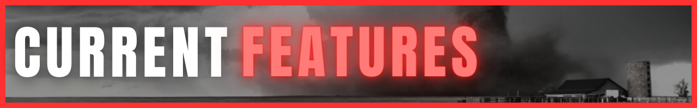
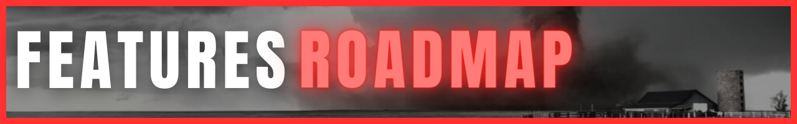
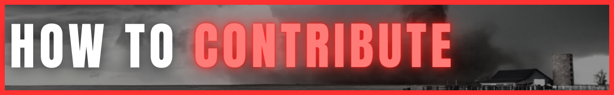
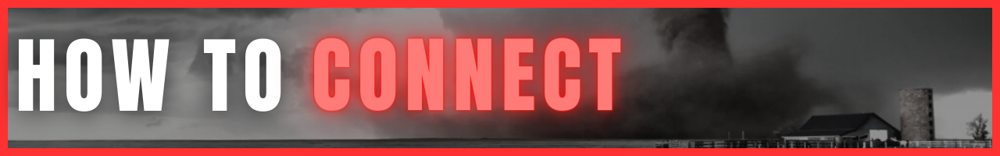

  <h2 id='tornado-warned-tagline'>
    <em><strong>Don't wait for the alert.  Stay ahead of mother nature's worst.</strong></em>
  </h2>

Meteorologists and severe weather experts have access to some awesome tools for knowing far in advance when dangerous weather will strike and tracking it in real-time. Unfortunately, these resources are not curated in a way that's easily accessible to the general public.

Most people depend on alerts from either their phones or tvs (if they even have cable or watch local stations) to know if dangerous weather is in the area. The reality is, by the time the alerts are received, it's often too late.

Think of [TornadoWarned.com](https://tornadowarned.com) as your own personal command center for following and staying ahead of severe weather...specifically the tornado-producing kind.

### **REAL-TIME SEVERE WEATHER ALERTS**

The [`alerts`](https://tornadowarned.com) screen displays active tornado warnings & tornado watches in real-time along with active alert counts using the [API Web Service](https://www.weather.gov/documentation/services-web-api#/default/alerts_active) from the National Weather Service.

  <image alt='convective outlook screenshot' src='public/images/active-alerts-ss.png'/>

### **3-DAY CATEGORICAL CONVECTIVE OUTLOOKS**

The [Convective Outlooks](https://www.spc.noaa.gov/products/outlook/) from the Storm Prediction Center provide extended forecasts specifically for severe weather, giving you plenty of time to establish a safety plan if necessary.

  <image alt='convective outlook screenshot' src='public/images/convective-outlooks-ss.png'/>

- [ ] Covective Outlooks category description tooltips
- [ ] NEXRAD radar map
  - [ ] including intractive alert polygons
- [ ] wind velocity map
- [ ] local storm reports
- [ ] historical tornado statistics and images from the [Tornado API](https://github.com/ephcoding/tornado-api)
- [ ] standardized feature request process
- [ ] standardized bug fix/issue process

### **NATIONAL WEATHER SERVICE**

- [API Web Service](https://www.weather.gov/documentation/services-web-api#/): real-time weather alerts and forecasts
- [Local Storm Report MapServer](https://mapservices.weather.noaa.gov/vector/rest/services/obs/nws_local_storm_reports/MapServer/): "Local Storm Reports (LSRs) from all NWS Weather Forecast Offices for 24 hour, 48 hour and 72 hour time periods. More information on LSR format may be found in [Section 5 of NWS Instruction 10-517](https://www.nws.noaa.gov/directives/sym/pd01005017curr.pdf). This data is updated every five minutes."
- [Radar Base Reflectivity MapServer](https://mapservices.weather.noaa.gov/eventdriven/rest/services/radar/radar_base_reflectivity/MapServer): 1km x 1km CONUS Radar Base Reflectivity.

### **STORM PREDICTION CENTER**

- [Convective Outlook MapServer](https://mapservices.weather.noaa.gov/vector/rest/services/outlooks/SPC_wx_outlks/MapServer): can be leveraged to obtain latest Convective Outlook forecasts and feature geometry
- [RSS Feeds](https://www.spc.noaa.gov/aboutrss.html): various RSS feeds for all the bad weather things.

Currently, [TornadoWarned.com](https://tornadowarned.com) is just a way for me to scratch my own tornado-obesession itch. If you have a killer idea for a new feature, or feature change, I'll definitely entertain it. If you find a bug, throw in a PR with a thorough description of the issue along with the correction code, and I'll get it merged.

GitHub: [ephcoding](https://github.com/ephcoding)

LinkedIn: [/in/ephraimjsmith](https://linkedin.com/in/ephraimjsmith)

Twitter: [@\_ephraimsmith](https://twitter.com/_ephraimsmith)
