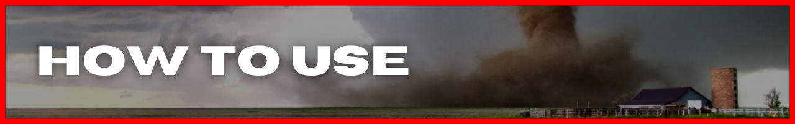
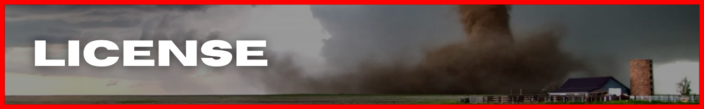
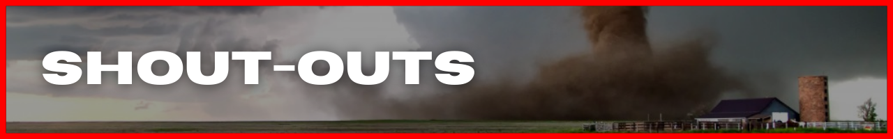

<!-- #region INTRO -->

<div align='center'>


</div>

<div align='right'>

[install](#install) | [use](#use) | [license](#license) | [contribute](#contribute) | [shout-outs](#shout-outs)

</div>

<div align='right'>

  <a href='https://github.com/modevx' alt='social link icon'>
    
  </a>
  &nbsp;
  &nbsp;
  <a href='mailto:email@modevx.com' alt='social link icon'>
    
  </a>
  &nbsp;
  &nbsp;
  <a href='https://twitter.com/modevxapps' alt='social link icon'>
    
  </a>
  &nbsp;
  &nbsp;
  <a href='https://instagram.com/modevxapps' alt='social link icon'>
    
  </a>
  &nbsp;
  &nbsp;
  <a href='https://linkedin.com/in/modevxapps' alt='social link icon'>
    
  </a>

</div>

**[TORNADO ACTION](https://tornadoaction.com)** is your home for real-time updates, alerts, news, education, safety and stats for all things TORNADOES!

There are tons of resources already available for storm safety and preparedness. The problem is, those resources are hard to find and the general public doesn't know about most of them.

If it has to do with tornadoes, **[TORNADO ACTION](https://tornadoaction.com)** has ( or will have ) it!

<!-- #endregion /INTRO -->

# INTRO

<!-- #region INSTALL -->

<div id='install' align='center'>


</div>

<div align='right'>

[install](#install) | [use](#use) | [license](#license) | [contribute](#contribute) | [shout-outs](#shout-outs) | [`BUILD_NOTES.md`](https://github.com/modevx/tornado-action)

</div>

<div align='right'>

  <a href='https://github.com/modevx' alt='social link icon'>
    
  </a>
  &nbsp;
  &nbsp;
  <a href='mailto:ephraim@modevx.com' alt='social link icon'>
    
  </a>
  &nbsp;
  &nbsp;
  <a href='https://twitter.com/modevx' alt='social link icon'>
    
  </a>
  &nbsp;
  &nbsp;
  <a href='https://instagram.com/modevx' alt='social link icon'>
    
  </a>
  &nbsp;
  &nbsp;
  <a href='https://linkedin.com/in/modevx' alt='social link icon'>
    
  </a>

</div>

<!-- #endregion /INSTALL -->

# INSTALL

clone repo

```shellscript
git clone https://github.com/modevx/tornado-action.git

```

install dependencies/packages

```shellscript
cd tornado-action

npm install

OR

yarn

```

run it

```shellscript
npm run dev

OR

yarn dev
```

<!-- #region HOW TO USE -->

<div id='use' align='center'>



</div>

<div align='right'>

[install](#install) | [use](#use) | [license](#license) | [contribute](#contribute) | [shout-outs](#shout-outs) | [`BUILD_NOTES.md`](https://github.com/modevx/tornado-action)

</div>

<div align='right'>

  <a href='https://github.com/modevx' alt='social link icon'>
    
  </a>
  &nbsp;
  &nbsp;
  <a href='mailto:ephraim@modevx.com' alt='social link icon'>
    
  </a>
  &nbsp;
  &nbsp;
  <a href='https://twitter.com/modevx' alt='social link icon'>
    
  </a>
  &nbsp;
  &nbsp;
  <a href='https://instagram.com/modevx' alt='social link icon'>
    
  </a>
  &nbsp;
  &nbsp;
  <a href='https://linkedin.com/in/modevx' alt='social link icon'>
    
  </a>

</div>

<!-- #endregion /HOW TO USE -->

# HOW TO USE

<!-- #region LICENSE -->

<div id='license' align='center'>



</div>

<div align='right'>

[install](#install) | [use](#use) | [license](#license) | [contribute](#contribute) | [shout-outs](#shout-outs) | [`BUILD_NOTES.md`](https://github.com/modevx/tornado-action)

</div>

<div align='right'>

  <a href='https://github.com/modevx' alt='social link icon'>
    
  </a>
  &nbsp;
  &nbsp;
  <a href='mailto:ephraim@modevx.com' alt='social link icon'>
    
  </a>
  &nbsp;
  &nbsp;
  <a href='https://twitter.com/modevx' alt='social link icon'>
    
  </a>
  &nbsp;
  &nbsp;
  <a href='https://instagram.com/modevx' alt='social link icon'>
    
  </a>
  &nbsp;
  &nbsp;
  <a href='https://linkedin.com/in/modevx' alt='social link icon'>
    
  </a>

</div>

<!-- #endregion /LICENSE -->

# LICENSE

<!-- #region CONTRIBUTE -->

<div id='contribute' align='center'>


</div>

<div align='right'>

[install](#install) | [use](#use) | [license](#license) | [contribute](#contribute) | [shout-outs](#shout-outs) | [`BUILD_NOTES.md`](https://github.com/modevx/tornado-action)

</div>

<div align='right'>

  <a href='https://github.com/modevx' alt='social link icon'>
    
  </a>
  &nbsp;
  &nbsp;
  <a href='mailto:ephraim@modevx.com' alt='social link icon'>
    
  </a>
  &nbsp;
  &nbsp;
  <a href='https://twitter.com/modevx' alt='social link icon'>
    
  </a>
  &nbsp;
  &nbsp;
  <a href='https://instagram.com/modevx' alt='social link icon'>
    
  </a>
  &nbsp;
  &nbsp;
  <a href='https://linkedin.com/in/modevx' alt='social link icon'>
    
  </a>

</div>

<!-- #endregion /CONTRIBUTE -->

# CONTRIBUTE

<!-- #region SHOUT-OUTS -->

<div id='shout-outs' align='center'>



</div>

<div align='right'>

[install](#install) | [use](#use) | [license](#license) | [contribute](#contribute) | [shout-outs](#shout-outs) | [`BUILD_NOTES.md`](https://github.com/modevx/tornado-action)

</div>

<div align='right'>

  <a href='https://github.com/modevx' alt='social link icon'>
    
  </a>
  &nbsp;
  &nbsp;
  <a href='mailto:ephraim@modevx.com' alt='social link icon'>
    
  </a>
  &nbsp;
  &nbsp;
  <a href='https://twitter.com/modevx' alt='social link icon'>
    
  </a>
  &nbsp;
  &nbsp;
  <a href='https://instagram.com/modevx' alt='social link icon'>
    
  </a>
  &nbsp;
  &nbsp;
  <a href='https://linkedin.com/in/modevx' alt='social link icon'>
    
  </a>

</div>

<!-- #endregion /SHOUT-OUTS -->

# SHOUT-OUTS

## **National Weather Service**

[GitHub](https://github.com/weather-gov) | [Twitter](https://twitter.com/NWS) | [YouTube](https://www.youtube.com/user/usweathergov)

- **_Web Service API_**
  - [API specs](https://www.weather.gov/documentation/services-web-api#/)
  - discussions on [GitHub](https://github.com/weather-gov/api/discussions)
