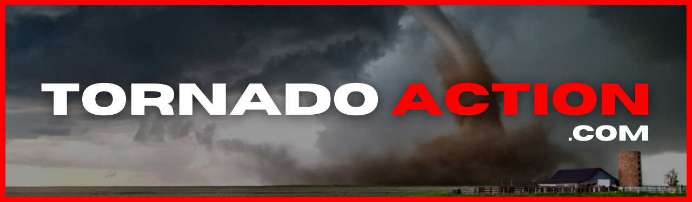
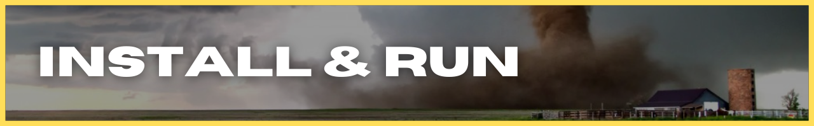
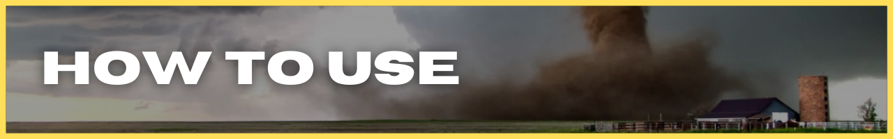
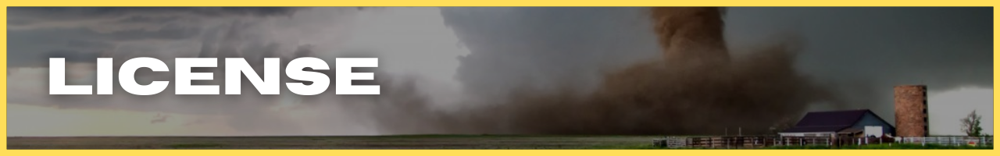
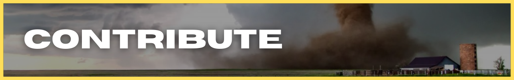
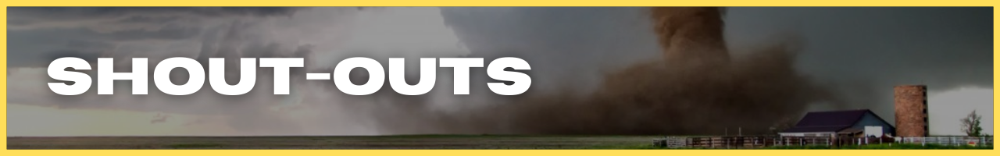

<!-- #region INTRO -->

[install](#install) | [use](#use) | [license](#license) | [contribute](#contribute) | [shout-outs](#shout-outs) | [`BUILD_NOTES.md`](https://github.com/ephraimsmithdev/tornado-action/blob/dev/BUILD_NOTES.md)

  
  &nbsp;
  &nbsp;
  
  &nbsp;
  &nbsp;
  
  &nbsp;
  &nbsp;
  
  &nbsp;
  &nbsp;
  

**[TORNADO ACTION](https://tornadoaction.com)** is your home for real-time updates, alerts, news, education, safety and stats for all things TORNADOES!

There are tons of resources already available for storm safety and preparedness. The problem is, those resources are hard to find and the general public doesn't know about most of them.

If it has to do with tornadoes, **[TORNADO ACTION](https://tornadoaction.com)** has ( or will have ) it!

**_Check out [`BUILD_NOTES.md`](https://github.com/ephraimsmithdev/rovercam/blob/prod/BUILD_NOTES.md) for a behind-the-scenes look at how TORNADO ACTION is getting built!_**

<!-- #endregion /INTRO -->

<!-- #region INSTALL -->

[install](#install) | [use](#use) | [license](#license) | [contribute](#contribute) | [shout-outs](#shout-outs) | [`BUILD_NOTES.md`](https://github.com/ephraimsmithdev/tornado-action)

  
  &nbsp;
  &nbsp;
  
  &nbsp;
  &nbsp;
  
  &nbsp;
  &nbsp;
  
  &nbsp;
  &nbsp;
  

<!-- #endregion /INSTALL -->

<!-- #region HOW TO USE -->

[install](#install) | [use](#use) | [license](#license) | [contribute](#contribute) | [shout-outs](#shout-outs) | [`BUILD_NOTES.md`](https://github.com/ephraimsmithdev/tornado-action)

  
  &nbsp;
  &nbsp;
  
  &nbsp;
  &nbsp;
  
  &nbsp;
  &nbsp;
  
  &nbsp;
  &nbsp;
  

<!-- #endregion /HOW TO USE -->

<!-- #region LICENSE -->

[install](#install) | [use](#use) | [license](#license) | [contribute](#contribute) | [shout-outs](#shout-outs) | [`BUILD_NOTES.md`](https://github.com/ephraimsmithdev/tornado-action)

  
  &nbsp;
  &nbsp;
  
  &nbsp;
  &nbsp;
  
  &nbsp;
  &nbsp;
  
  &nbsp;
  &nbsp;
  

<!-- #endregion /LICENSE -->

<!-- #region CONTRIBUTE -->

[install](#install) | [use](#use) | [license](#license) | [contribute](#contribute) | [shout-outs](#shout-outs) | [`BUILD_NOTES.md`](https://github.com/ephraimsmithdev/tornado-action)

  
  &nbsp;
  &nbsp;
  
  &nbsp;
  &nbsp;
  
  &nbsp;
  &nbsp;
  
  &nbsp;
  &nbsp;
  

<!-- #endregion /CONTRIBUTE -->

<!-- #region SHOUT-OUTS -->

[install](#install) | [use](#use) | [license](#license) | [contribute](#contribute) | [shout-outs](#shout-outs) | [`BUILD_NOTES.md`](https://github.com/ephraimsmithdev/tornado-action)

  
  &nbsp;
  &nbsp;
  
  &nbsp;
  &nbsp;
  
  &nbsp;
  &nbsp;
  
  &nbsp;
  &nbsp;
  

<!-- #endregion /SHOUT-OUTS -->
